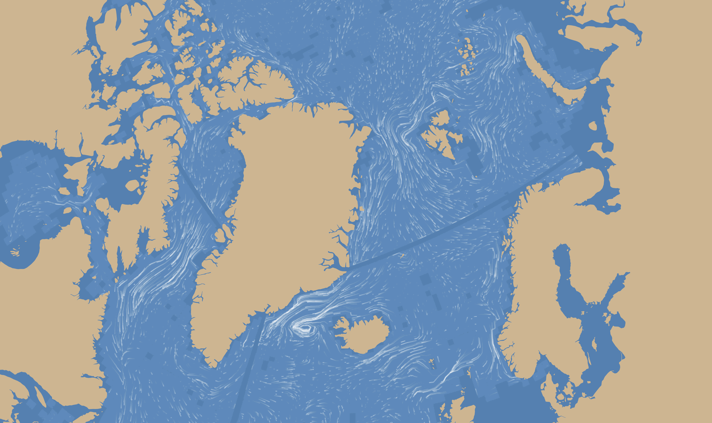
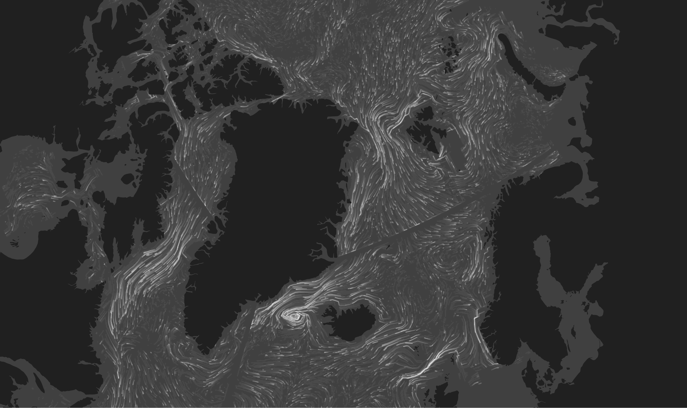

# Arctic Ocean Current Visualization

This project visualizes ocean currents using data from the *MIT General
Circulation Model* (MITGCM). It leverages *D3.js* for rendering the
visualization and is built with *Vite* (an arbitrary choice).




There is a [dist
branch](https://github.com/ubesluttsom/arctic-currents/tree/dist), if you don't
want to install the dependencies.

To start the development server (requires *node.js*):

```bash
npm install
npm run dev
```

To build the project for production:

```bash
npm run build
```

The build artifacts will be stored in the `dist/` directory.

---

This largely was inspired by the much more comprehensive
[*earth*](https://earth.nullschool.net) project by Cameron Beccario, and
probably would not be possible without a peek at his [source
code](https://github.com/cambecc/earth). The main difference is the data used.
